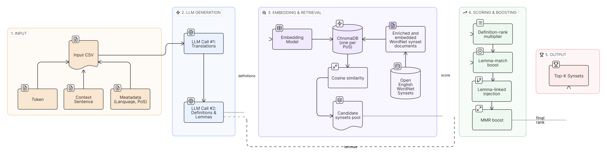

# Inspicio

Inspicio is a configurable, open-vocabulary Word-Sense Disambiguation retrieval pipeline for historical and low-resource languages. It retrieves a set of candidate synsets from the Open English WordNet for toekns in any language, based on their context.



## Inputs

The CSV runner expects these columns by default:

- `ID`
- `language`
- `TOKEN`
- `LEMMA`
- `SENTENCE`
- `PoS` with one of `verb`, `noun`, `adjective`, `adverb`
- `VERB SEMANTICS` for optional gold synset labels

Gold labels may be blank. Rows without gold are still tagged and written to JSONL, but they are excluded from aggregate Recall/MRR.

Column names are configurable under `columns:` in each YAML file.

## Install

```bash
pip install -r requirements.txt
```

For local embedding models:

```bash
pip install ".[local]"
```

Set the API keys needed by your config, for example:

```bash
set OPENAI_API_KEY=...
set DEEPSEEK_API_KEY=...
set MISTRAL_API_KEY=...
set OPENROUTER_API_KEY=...
```

On macOS/Linux, use `export` instead of `set`.

## Build Indexes

Build all four PoS indexes:

```bash
python scripts/build_index.py --config configs/deepseek_openai.yaml --pos all
```

Build one PoS index:

```bash
python scripts/build_index.py --config configs/deepseek_openai.yaml --pos noun
```

The default paths are:

- `./oewn_verb_embeddings` / `oewn_verbs`
- `./oewn_noun_embeddings` / `oewn_nouns`
- `./oewn_adjective_embeddings` / `oewn_adjectives`
- `./oewn_adverb_embeddings` / `oewn_adverbs`

Change `index.chroma_path_template` and `index.collection_template` to use different models, for example Cohere or Jina.

## Run Full Pipeline

```bash
python scripts/run_pipeline.py --config configs/deepseek_openai.yaml
```

Provider examples:

- DeepSeek: `configs/deepseek_openai.yaml`
- Mistral: `configs/mistral_openai.yaml`
- OpenRouter for Kimi/Qwen/GLM: `configs/openrouter_openai.yaml`
- Any OpenAI-compatible LLM endpoint with a custom base URL: `configs/custom_llm_openai_compatible.yaml`

For a custom LLM provider, set:

```yaml
llm:
  provider: openai-compatible
  base_url: https://your-provider.example.com/v1
  model: your-model-name
  api_key_env: CUSTOM_LLM_API_KEY
```

To skip translation and ask the glossing model to work from the source sentence directly:

```yaml
generation:
  translation_enabled: false
```

## Retrieval-Only Mode

Use this when you already have `GENERATED_ENRICHED` and optionally `GENERATED_TRANSLATIONS` in a prior JSONL output:

```bash
python scripts/run_pipeline.py --config configs/retrieval_only_cohere.yaml
```

Override paths without editing YAML:

```bash
python scripts/run_pipeline.py --config configs/retrieval_only_cohere.yaml --input-jsonl outputs/prior.jsonl --output-jsonl outputs/new.jsonl
```

Local embedding examples:

- Jina: `configs/local_jina.yaml`
- Qwen3-Embedding: `configs/local_qwen_embedding.yaml`
- Harrier: `configs/local_harrier.yaml`
- KaLM: `configs/local_kalm.yaml`

These configs preserve aome model-specific quirks:

- Qwen uses tokenizer left padding and an instruction query prompt.
- Harrier uses `model_kwargs.dtype: auto`, `query_prompt_name: sts_query`, and text-tokenizer loading.
- KaLM uses `model_kwargs.torch_dtype: auto` and text-tokenizer loading.

The same configs can build matching indexes:

```bash
python scripts/build_index.py --config configs/local_qwen_embedding.yaml --pos all
python scripts/build_index.py --config configs/local_harrier.yaml --pos all
python scripts/build_index.py --config configs/local_kalm.yaml --pos all
```

## Evaluate Existing Output

```bash
python scripts/evaluate.py --config configs/deepseek_openai.yaml --input-jsonl outputs/output_deepseek_openai.jsonl
```

## Output

Each output line keeps the original row and adds:

- `GENERATED_TRANSLATIONS`
- `GENERATED_ENRICHED`
- `GROUND_TRUTH`
- `EVALUATION`
- `RETRIEVAL_META`
- `RETRIEVED_SYNSETS`